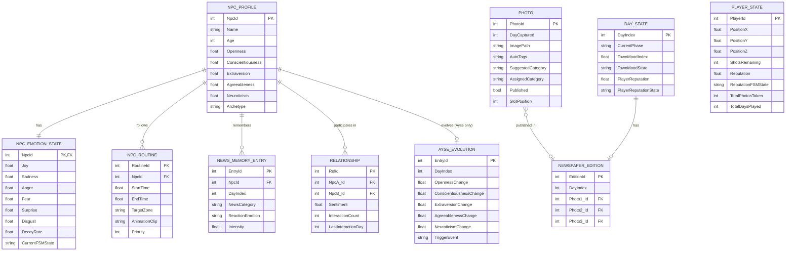
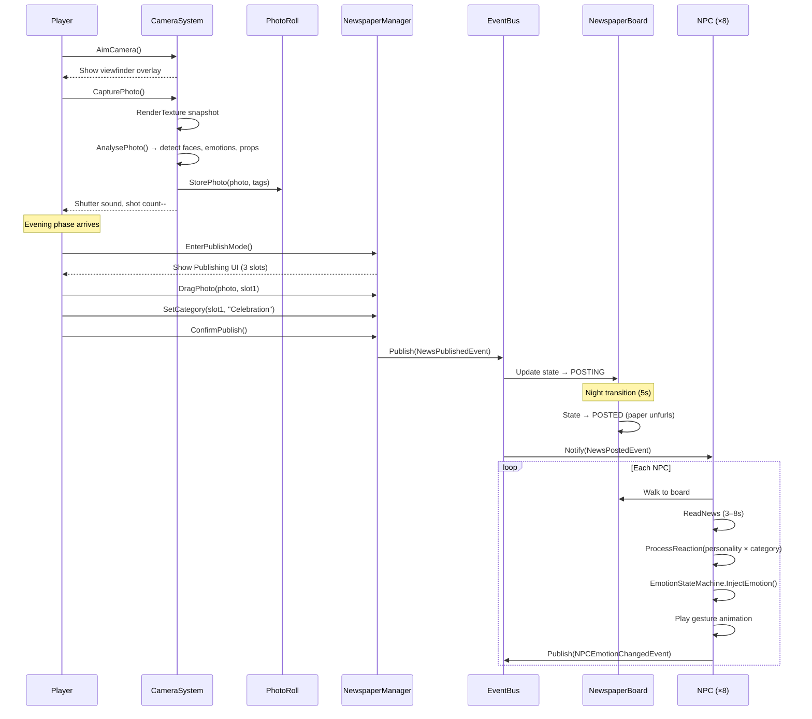
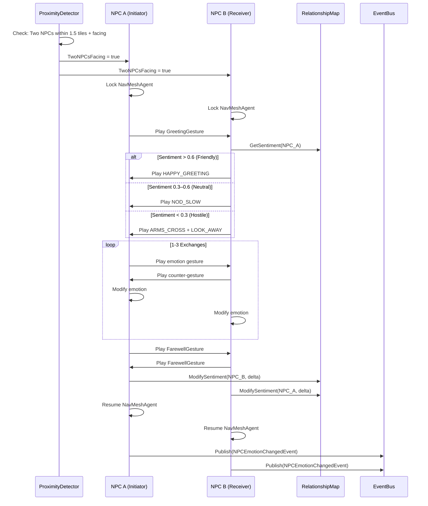
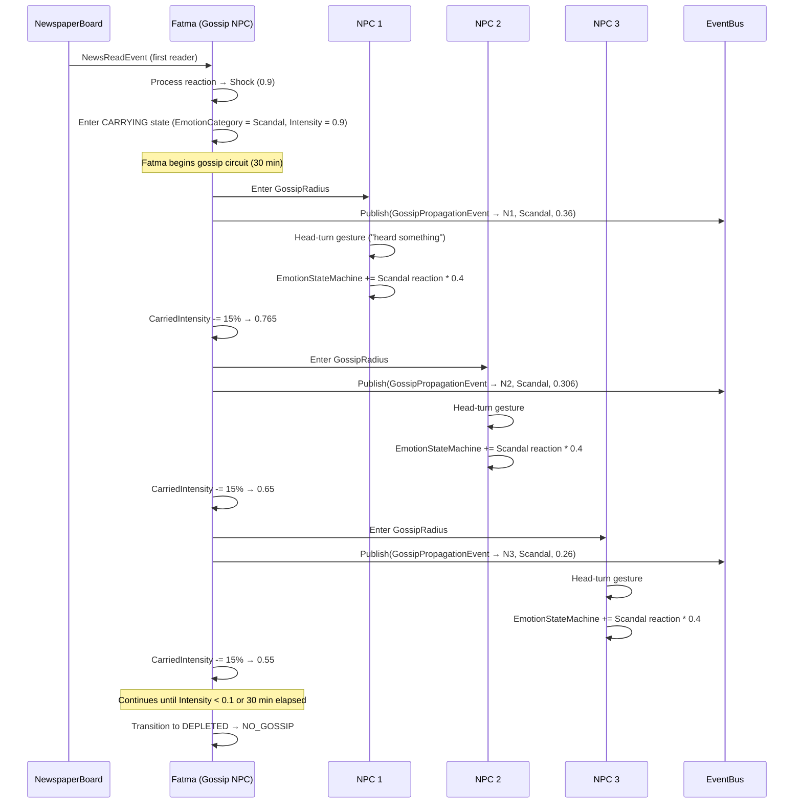
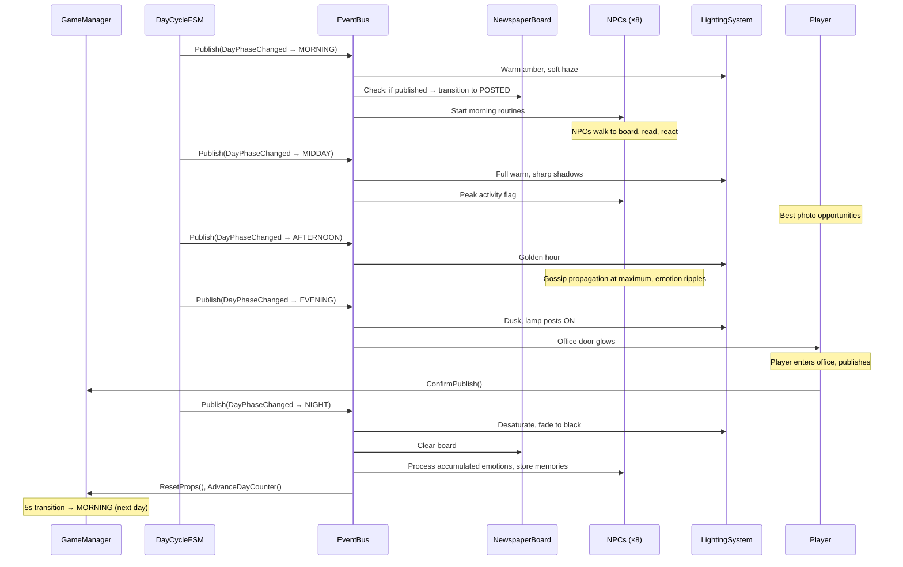
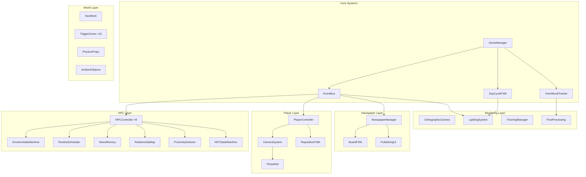

# GP-OYUN — Project Report
## Graduation Project: 2.5D Pantomime Social Simulation

---

**Project Title**: GP-OYUN — A Silent Town Where Every Photo Tells a Story  
**Type**: Game Development — 2.5D Narrative Social Simulation  
**Engine**: Unity (URP)  
**Platform**: PC (Windows / macOS)  
**Language**: C#  
**3D Pipeline**: Blender → FBX → Unity  
**Date**: April 2026  

---

## Table of Contents

1. [Executive Summary](#1-executive-summary)
2. [Problem Statement & Motivation](#2-problem-statement--motivation)
3. [Game Concept](#3-game-concept)
4. [Use Cases](#4-use-cases)
5. [Scenarios](#5-scenarios)
6. [Class Diagram](#6-class-diagram)
7. [Database / Data Model Diagram](#7-database--data-model-diagram)
8. [Sequence Diagrams](#8-sequence-diagrams)
9. [System Architecture](#9-system-architecture)
10. [What Makes This a Game](#10-what-makes-this-a-game)
11. [Technical Stack & Tools](#11-technical-stack--tools)
12. [Risk Analysis](#12-risk-analysis)
13. [Project Timeline](#13-project-timeline)
14. [References](#14-references)

---

## 1. Executive Summary

GP-OYUN is a **2.5D single-screen social simulation** game where all communication between characters is conducted entirely through **body language, facial expressions, and gestures** — zero dialogue, zero text, zero speech.

The player is a photojournalist who has just arrived in a small town. Their job is to observe the townspeople, capture moments with a camera, and publish photos in the daily newspaper. Every editorial decision — what to publish, how to frame it — creates **ripple effects** through the emotional lives of 8 NPC characters who live, interact, and remember independently.

The game explores the power of media, the ethics of observation, and the fragility of human community — all without a single spoken word.

---

## 2. Problem Statement & Motivation

### 2.1 Academic Context
This project addresses the intersection of:
- **AI-driven NPC behaviour** — parallel, personality-based autonomous agents
- **Non-verbal communication systems** — conveying complex emotions without language
- **Player agency in narrative design** — player as editor, not as hero
- **Emergent gameplay** — unpredictable outcomes from simple rule interactions

### 2.2 Industry Gap
Most narrative games rely on dialogue trees, text prompts, or voice acting. GP-OYUN demonstrates that **meaning can emerge from pure visual behaviour** — making the game universally accessible regardless of language.

### 2.3 Technical Challenge
Running 8 autonomous NPC agents, each with personality models, emotion systems, memory, relationships, and daily routines — simultaneously, in real-time — within a single fixed-camera scene.

---

## 3. Game Concept

| Aspect | Description |
|---|---|
| **Genre** | 2.5D Narrative Simulation / Social Sandbox |
| **Camera** | Fixed orthographic isometric (45° tilt), no scroll/zoom |
| **Communication** | 100% non-verbal — facial expressions, gestures, posture |
| **Core Loop** | Observe → Capture → Publish → Watch Reactions |
| **Tone** | Warm, slightly absurd, deeply human |
| **Duration** | ~30 in-game days (5 chapters), ~5–8 hours playtime |
| **USP** | The newspaper as both tool and mirror — player shapes reality |

---

## 4. Use Cases

### UC-01: Player Captures a Photo

| Field | Description |
|---|---|
| **Actor** | Player |
| **Precondition** | Player has remaining shots today (≥1), camera cooldown complete |
| **Trigger** | Player holds Aim button, presses Capture |
| **Main Flow** | 1. Player enters aim mode → viewfinder overlay appears |
|  | 2. Player positions frame over scene |
|  | 3. Player presses capture → RenderTexture snapshot taken |
|  | 4. System analyses snapshot: detects NPCs, emotions, props |
|  | 5. Auto-tag generated (e.g., "Scandal", "Celebration") |
|  | 6. Photo stored in session roll |
|  | 7. Shot count decremented, cooldown begins (4s) |
| **Postcondition** | Photo available in roll for publishing |
| **Alt Flow A** | No shots remaining → viewfinder shows "empty" icon, no capture |
| **Alt Flow B** | Photo contains player reflection → hidden "META" tag added |

---

### UC-02: Player Publishes Newspaper

| Field | Description |
|---|---|
| **Actor** | Player |
| **Precondition** | Evening phase, player at Newspaper Office, ≥1 photo in roll |
| **Trigger** | Player enters Newspaper Office trigger zone |
| **Main Flow** | 1. Publishing UI opens (3 slots + photo roll) |
|  | 2. Player drags photos to Slot 1, 2, or 3 |
|  | 3. Player assigns/confirms category per photo |
|  | 4. Player presses PUBLISH |
|  | 5. NewsPublishedEvent fired with photo data |
|  | 6. Night transition begins |
| **Postcondition** | Board will display news next morning, NPCs will react |
| **Alt Flow A** | Player publishes 0 photos (empty publish) → board stays EMPTY next day |
| **Alt Flow B** | Player doesn't visit office → auto-timeout triggers night, no publication |

---

### UC-03: NPC Reads Newspaper

| Field | Description |
|---|---|
| **Actor** | NPC |
| **Precondition** | Morning phase, board in POSTED state |
| **Trigger** | NPC enters NewspaperBoard trigger zone |
| **Main Flow** | 1. NPC stops walking, approaches board |
|  | 2. NPC enters READING_NEWS state (3–8s) |
|  | 3. For each published photo, NPC processes: |
|  |    a. Check photo category (Scandal/Celebration/etc.) |
|  |    b. Cross-reference with personality traits (OCEAN) |
|  |    c. Calculate emotion reaction (6-axis vector) |
|  |    d. Apply emotion to EmotionStateMachine |
|  | 4. NPC transitions to REACTING state |
|  | 5. Gesture plays (unique per emotion/personality combo) |
|  | 6. NewsMemory updated (7-day window) |
| **Postcondition** | NPC carries new emotional state for rest of day |

---

### UC-04: NPC-to-NPC Silent Conversation

| Field | Description |
|---|---|
| **Actors** | NPC A, NPC B |
| **Precondition** | Both within 1.5 tiles, facing each other |
| **Trigger** | ProximityDetector fires TwoNPCsFacing |
| **Main Flow** | 1. Both NPCs stop (NavMeshAgent paused) |
|  | 2. Initiator plays greeting gesture |
|  | 3. Receiver plays response (from RelationshipData) |
|  | 4. 1–3 gesture exchanges (emotion transfer on each) |
|  | 5. Both play farewell gesture |
|  | 6. NavMesh resumes, both carry modified emotions |
| **Postcondition** | Both NPCs' emotional states and relationship values updated |

---

### UC-05: Gossip Propagation (Fatma)

| Field | Description |
|---|---|
| **Actor** | Fatma Hanım (NPC-02) |
| **Precondition** | Fatma has read newspaper, in CARRYING gossip state |
| **Trigger** | Any NPC enters Fatma's GossipRadius (2.0 tiles) |
| **Main Flow** | 1. GossipPropagationEvent fired |
|  | 2. Target NPC receives 40% of Fatma's emotional charge |
|  | 3. Target plays "heard something" head-turn |
|  | 4. Fatma's charge reduced by 15% |
|  | 5. Fatma continues to next NPC |
| **Postcondition** | Target NPC's emotion modified; Fatma's charge depleted over time |

---

### UC-06: Day Cycle Progression

| Field | Description |
|---|---|
| **Actor** | System (GameManager) |
| **Trigger** | Timer reaches phase threshold |
| **Main Flow** | 1. DayPhaseChangedEvent published |
|  | 2. All listeners update: lighting, NPC routines, board state |
|  | 3. Phase-specific systems activate/deactivate |
|  | 4. On NIGHT phase: reset props, clear board, process emotions, day++ |
| **Postcondition** | Game world reflects new phase state |

---

### UC-07: Player Reputation Change

| Field | Description |
|---|---|
| **Actor** | System |
| **Trigger** | Photo published that affects an NPC who was captured in it |
| **Main Flow** | 1. Captured NPC reads newspaper and sees own face |
|  | 2. If photo category = Scandal/Disaster and NPC is subject → reputation penalty |
|  | 3. If photo category = Celebration and NPC is subject → reputation bonus |
|  | 4. Reputation value recalculated |
|  | 5. If reputation crosses threshold → FSM state transition |
| **Postcondition** | NPC behaviour toward player changes based on new reputation state |

---

### UC-08: Peak Moment Photo Opportunity

| Field | Description |
|---|---|
| **Actor** | Player |
| **Precondition** | NPC in Peak Moment (any emotion ≥ 0.85) |
| **Trigger** | Player aims camera at Peak Moment NPC |
| **Main Flow** | 1. Camera viewfinder shows subtle glow indicator |
|  | 2. Player decides to capture or not |
|  | 3. If captured: photo tagged with PeakEmotion, high-impact |
|  | 4. Peak Moment lasts 2–4 seconds before decay |
| **Postcondition** | High-impact photo in roll; NPC vulnerability captured |

---

## 5. Scenarios

### Scenario 1: "The Baker's Bad Day"

```
Day:    4
Phase:  Morning

Context:
  Player published a "Disaster" photo of smoke from Agop's bakery on Day 3.

Morning Sequence:
  1. Board posts: Photo of bakery smoke, tagged DISASTER
  2. Fatma reaches board first — dramatic shock gesture (Surprise: 0.9)
  3. Fatma enters CARRYING state, runs to each NPC
  4. Agop reaches board — reads, sees his own bakery in flames framing
     → Emotion: Sadness 0.7, Anger 0.3 (his bakery is his life)
     → Behaviour: stops serving customers, stares at door
  5. Leila reads — Distressed (0.95), presses sketchbook to chest
  6. Selin reads — Fear (0.6), clutches pram handle tighter
  7. Hüseyin reads — one slow head shake (Disapproval toward player)

Afternoon:
  8. Agop sits alone on bench — first time he's left bakery during work hours
  9. Leila notices Agop, approaches, comfort gesture
  10. Player has a choice: photograph this tender moment?
      → Publishing as "Celebration" → town sees healing → mood recovers
      → Publishing as "Scandal" → exploits Agop's pain → trust erodes

Consequence:
  If player exploits: Agop starts turning away from camera on Day 5+
```

---

### Scenario 2: "The Silent Reconciliation"

```
Day:    12
Phase:  All day

Context:
  Hüseyin and Mustafa haven't played chess for 2 days (feud after Day 10 news).

Morning:
  1. Hüseyin walks to chess table as usual — but sits alone
  2. Mustafa walks past, sees Hüseyin, hesitates (1s pause in walk)
  3. Mustafa continues walking → Hüseyin's shoulders drop slightly (Sadness: 0.3)

Midday:
  4. Leila, observing from bench, sketches the empty chess table
  5. Fatma notices Hüseyin alone → approaches, Comfort gesture
  6. Hüseyin: slow nod → one quiet exhale (accepting sympathy)

Afternoon:
  7. Mustafa returns to chess table — stands 2 tiles away, arms crossed
  8. Hüseyin looks up — neither moves for 4 seconds → Peak Moment (both)
  9. Mustafa uncrosses arms → walks to seat → sits
  10. Single chess move gesture from Hüseyin → Mustafa nods
      → Synchronized emotion achieved: RARE EVENT
      → Both NPCs in same emotional state → special joint animation

Player Opportunity:
  This is the once-per-chapter reconciliation photo.
  Published as "Celebration" → massive positive ripple through town.
```

---

### Scenario 3: "Ayşe's Letter"

```
Day:    17
Phase:  Morning

Context:
  Ayşe has been evolving her personality based on witnessed events.
  Today she receives a letter at the Post Box.

Sequence:
  1. Ayşe walks to Post Box (part of routine)
  2. Checks mail — GOOD NEWS letter today
  3. Joy burst (+0.5) — eyes wide, slight bounce in step
  4. Ayşe changes routine: walks to Mihail's flower stall (first time ever)
  5. Mihail's joy aura boosts Ayşe further → she picks up a flower
  6. Ayşe walks to Leila at park bench → extends flower
  7. Leila: Surprise (0.7) → then Joy (0.6) → takes flower → warm gesture

Player Opportunity:
  This is Ayşe's personality being written in real-time by the game.
  If player captures the flower exchange → publishes as "Celebration"
  → Ayşe's Openness and Agreeableness shift upward permanently
  → She becomes a regular at the flower stall and park
```

---

## 6. Class Diagram

```mermaid
classDiagram
    class GameManager {
        -DayCycleFSM dayCycle
        -TownMoodTracker moodTracker
        -EventBus eventBus
        +StartDay()
        +AdvancePhase()
        +EndDay()
    }

    class EventBus {
        -Dictionary~Type, List~Action~~ listeners
        +Publish~T~(T event)
        +Subscribe~T~(Action~T~ listener)
        +Unsubscribe~T~(Action~T~ listener)
    }

    class NPCController {
        -NPCProfile profile
        -RoutineScheduler scheduler
        -EmotionStateMachine emotions
        -ProximityDetector proximity
        -NewsMemory memory
        -RelationshipMap relationships
        -NPCStateMachine fsm
        +RunCoroutine()
        +ReactToNews(NewsCategory)
        +ReceiveGossip(EmotionType, float)
    }

    class NPCProfile {
        +string Name
        +int Age
        +float Openness
        +float Conscientiousness
        +float Extraversion
        +float Agreeableness
        +float Neuroticism
        +DailyRoutine[] Routines
    }

    class EmotionStateMachine {
        -float joy
        -float sadness
        -float anger
        -float fear
        -float surprise
        -float disgust
        -float decayRate
        +float[] GetEmotionVector()
        +void InjectEmotion(EmotionType, float)
        +void Decay(float deltaTime)
        +bool IsPeakMoment()
    }

    class RoutineScheduler {
        -RoutineEntry[] schedule
        -int currentIndex
        +RoutineEntry GetCurrentTask(float gameTime)
        +void InterruptForPriority(int priority)
        +void Resume()
    }

    class NewsMemory {
        -NewsMemoryEntry[] entries
        -int windowSize
        +void AddEntry(NewsCategory, EmotionType, float, int)
        +BaselineModifier GetAccumulatedEffect()
        +bool HasConsecutive(NewsCategory, int count)
    }

    class RelationshipMap {
        -Dictionary~int, float~ sentiments
        +float GetSentiment(int npcId)
        +void ModifySentiment(int npcId, float delta)
        +int[] GetFriends()
        +int[] GetRivals()
    }

    class ProximityDetector {
        -float detectionRadius
        -List~NPCController~ nearbyNPCs
        +bool IsPlayerNearby()
        +NPCController[] GetFacingNPCs()
        +bool TwoNPCsFacing()
    }

    class PlayerController {
        -CameraSystem camera
        -ReputationFSM reputation
        -PhotoRoll photoRoll
        +void Move(Vector3 direction)
        +void AimCamera()
        +void CapturePhoto()
        +void EnterPublishMode()
    }

    class CameraSystem {
        -int shotsRemaining
        -float cooldownTimer
        -RenderTexture captureTexture
        +Photo TakePhoto()
        +PhotoTag[] AnalysePhoto(Photo)
        +bool CanShoot()
    }

    class Photo {
        +Texture2D Image
        +PhotoTag[] Tags
        +NewsCategory SuggestedCategory
        +NewsCategory AssignedCategory
        +int DayCaptured
        +Vector3 WorldPosition
    }

    class NewspaperManager {
        -Photo[] publishedPhotos
        -BoardFSM boardFSM
        +void PublishEdition(Photo[])
        +void PostToBoard()
        +BoardState GetBoardState()
    }

    class TownMoodTracker {
        -float moodIndex
        -TownMoodFSM moodFSM
        +void RecalculateMood(NPCController[])
        +float GetMoodIndex()
        +TownMoodState GetState()
    }

    class NPCStateMachine {
        -NPCState currentState
        -NPCState[] allStates
        +void Transition(NPCState newState)
        +void Update()
        +NPCState GetCurrentState()
    }

    class NPCState {
        <<abstract>>
        +void Enter(NPCController npc)
        +void Execute(NPCController npc)
        +void Exit(NPCController npc)
    }

    GameManager --> EventBus
    GameManager --> TownMoodTracker
    GameManager --> NewspaperManager
    GameManager "1" --> "8" NPCController
    GameManager --> PlayerController

    NPCController --> NPCProfile
    NPCController --> EmotionStateMachine
    NPCController --> RoutineScheduler
    NPCController --> NewsMemory
    NPCController --> RelationshipMap
    NPCController --> ProximityDetector
    NPCController --> NPCStateMachine

    NPCStateMachine --> NPCState

    PlayerController --> CameraSystem
    PlayerController --> ReputationFSM

    CameraSystem --> Photo

    NewspaperManager --> Photo
    NewspaperManager --> BoardFSM

    NPCController ..> EventBus : subscribes
    PlayerController ..> EventBus : publishes
    NewspaperManager ..> EventBus : publishes
```



---

## 7. Database / Data Model Diagram

> GP-OYUN uses **in-memory data structures** (no external database). All state is persisted through Unity's save system (JSON serialisation) at the end of each day.



---

## 8. Sequence Diagrams

### SD-01: Photo Capture & Publish Sequence



---

### SD-02: NPC Silent Conversation



---

### SD-03: Gossip Propagation Chain



---

### SD-04: Day Cycle Full Sequence



---

## 9. System Architecture



---

## 10. What Makes This a Game

### 10.1 The Five Pillars of "Game-ness"

| Pillar | How GP-OYUN Implements It |
|---|---|
| **Agency** | Player chooses what to photograph, how to frame it, what to publish |
| **Challenge** | Limited shots, parallel events, reputation management, survival |
| **Consequence** | Every publishing decision creates cascading NPC reactions |
| **Progression** | Story beats, evolving relationships, town mood arc, 5 chapters |
| **Failure States** | Exile (reputation), bankruptcy (no publishing), town collapse |

### 10.2 Player Engagement Hooks

1. **Discovery**: What happens if I publish THIS? The game rewards experimentation
2. **Empathy**: NPCs are readable, relatable — their pain feels real without words
3. **Strategy**: Managing 8 NPCs' emotional states is a real-time social puzzle
4. **Moral Weight**: "Should I exploit this moment?" — a question with no safe answer
5. **Emergent Stories**: No two playthroughs produce the same narrative

### 10.3 Why It Works Without Words

- **Universal Readability**: Gestures > dialogue. Everyone understands a crossed arm or a tear
- **Simultaneous Narratives**: 8 stories at once, all visible — the player chooses what to watch
- **The Newspaper as Mirror**: The player sees their own choices reflected in NPC reactions
- **Memory & Accumulation**: Actions compound. Day 20 is shaped by Day 3's choices

---

## 11. Technical Stack & Tools

| Category | Tool | Purpose |
|---|---|---|
| **Engine** | Unity 2022 LTS + URP | Core game engine |
| **Language** | C# | All gameplay scripts |
| **3D Modelling** | Blender 4.x | Character and environment modelling |
| **Rigging** | Blender + Mixamo | Humanoid rig, base animations |
| **Animation** | Blender (custom) + Unity Mecanim | Gesture library, blend trees |
| **Textures** | Substance Painter / Blender | Character and environment textures |
| **Version Control** | Git + LFS | Large binary asset tracking |
| **Build** | Unity Build Pipeline | PC standalone |
| **Testing** | Unity Test Framework + NUnit | FSM and logic unit tests |

---

## 12. Risk Analysis

| Risk | Impact | Probability | Mitigation |
|---|---|---|---|
| 8 NPC coroutines cause performance issues | High | Medium | Profile early, pool coroutines, simplify AI off-camera |
| Facial expressions unreadable at isometric distance | High | High | **Focus on body > face. Exaggerate. Use emoji-style indicators** |
| FSM deadlocks (NPC stuck in state) | Critical | Medium | Force-timeout on every state, fallback to IDLE |
| Animation quality insufficient | Medium | Medium | Use Mixamo for base, hand-key only gestures |
| Photo scoring feels opaque to player | Medium | Low | Design intent: opacity is a feature, not a bug |
| Scope creep | High | High | Phase-gated TODO with strict gates between phases |

---

## 13. Project Timeline

| Phase | Duration | Deliverable |
|---|---|---|
| **Phase 0**: Foundation | 2 weeks | Hello world: player moves, NPC walks, no crashes |
| **Phase 1**: Characters & Pipeline | 3 weeks | 8 rigged characters, gesture library, Mecanim setup |
| **Phase 2**: Environment | 2 weeks | Full town square, all interactive objects, NavMesh |
| **Phase 3**: NPC AI & FSM | 4 weeks | All FSMs implemented, 8 NPCs running parallel routines |
| **Phase 4**: Newspaper System | 2 weeks | Photo capture, publishing UI, board reaction sequence |
| **Phase 5**: Emotion Engine | 2 weeks | 6-axis model, face/body mapping, decay system |
| **Phase 6**: Rendering & Polish | 2 weeks | Lighting, sorting, post-processing, day/night visuals |
| **Phase 7-8**: Social & Audio | 2 weeks | Relationships, gossip, ambient sound, NPC audio |
| **Phase 9**: UI/UX | 1 week | All player-facing UI |
| **Phase 10**: Story & Progression | 2 weeks | 5 chapters, scripted beats, endings |
| **Phase 11**: Testing & Demo | 2 weeks | Full playtest, demo build |

**Total Estimated: ~24 weeks (6 months)**

---

## 14. References

1. Ekman, P. *Emotions Revealed* (2003) — 6 basic emotion model
2. Bartle, R. *Designing Virtual Worlds* (2003) — Player typology
3. Hunicke, LeBlanc, Zubek. *MDA: A Formal Approach to Game Design* (2004)
4. Yannakakis & Togelius. *Artificial Intelligence and Games* (2018)
5. Unity Documentation — NavMesh, Mecanim, URP
6. Blender Documentation — Rigging, Weight Painting, FBX Export

---

*This document is a living artifact. Updated as design decisions are finalised and implementation progresses.*
