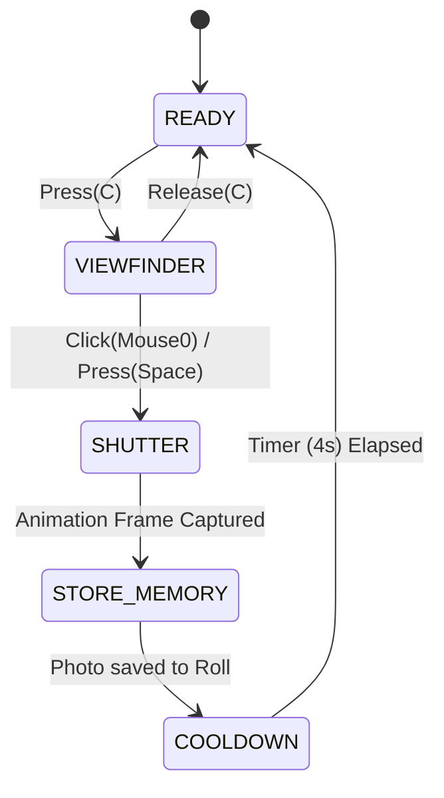
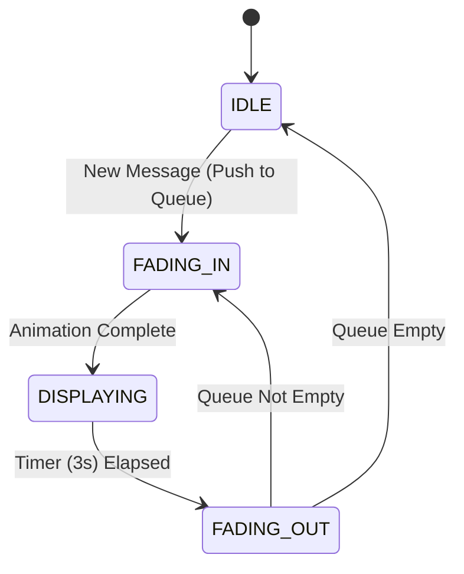

# GP-OYUN — Game Design Document
## File 11: UI Finite State Machines & Sub-Systems

This document details the state-driven logic for all user interface elements, ensuring that HUD buttons, settings menus, and notifications respond predictably to game phases and player input.

---

## 1. UI Master FSM (State Overlay Manager)

This FSM controls the visibility and interactability of the on-screen overlays and prevents state conflicts (e.g., opening settings while in the Newspaper Editor).

| State | Visibility | Permitted Actions | Transition Trigger |
|---|---|---|---|
| **HUD_ONLY** | Full HUD | Movement, Interaction | `C` (Hold) -> CAMERA_SYS |
| **CAMERA_SYS**| Viewfinder Overlay | Movement (Slowed), Capture | `C` (Release) -> HUD_ONLY |
| **NEWSPAPER_ED**| Editor Fullscreen | Photo Selection, Categorizing | `Esc` -> HUD_ONLY, `Confirm` -> HUD_ONLY |
| **MODAL_OPEN** | Blurred HUD | Settings Navigation | `Esc` -> HUD_ONLY |
| **NIGHT_RECAP** | Fullscreen Summary | Review Daily News | Auto -> HUD_ONLY (Morning) |

---

## 2. Sub-FSM: Camera System
**Level**: Player Tool Sub-State
**Context**: Active when UI Master is in `CAMERA_SYS`.

- **SHUTTER**: Brief 0.1s freeze-frame for visual feedback.
- **STORE_MEMORY**: Logic that computes AI tags (Chaos, Interaction, etc.).

---

## 3. Sub-FSM: Newspaper Editor (The "Desk" Mode)
**Level**: UI Interaction Sub-State
**Context**: Active during Evening in the Office zone.

| State | Behaviour | Exit Trigger |
|---|---|---|
| **SELECT_PHOTO** | Scroll through Today's Roll | Select Photo -> CATEGORIZING |
| **CATEGORIZING** | Pick from 5 Categories (Scandal, Local, etc.) | Selection Confirmed -> CONFIRM_PAGE |
| **CONFIRM_PAGE** | Final preview of Headline + Photo | `Publish` -> PUBLISHED (Close UI) |

> **Design Note**: The editor is NOT "obvious." The player must weigh the risk of a `Scandal` category (high impact, high distress) versus a `Local` category (low impact, stable mood).

---

## 4. Sub-FSM: Settings & Menu Nesting

The Settings menu is a nested state machine that preserves user data across transitions.

- **[GENERAL]**: Language, Accessibility (Text size).
- **[AUDIO]**: Master, Music, SFX, Ambient volume.
- **[GRAPHICS]**: Quality presets, Resolution, Post-Processing toggles.
- **[CONTROLS]**: Key rebinding table.

### Transition Rules:
- Transition `ANY` → `SETTINGS_MENU` triggers `Time.timeScale = 0` (Global Pause).
- Transition `SETTINGS_MENU` → `ANY` triggers `Time.timeScale = 1` (Global Resume).

---

## 3. Sub-FSM: Notification System

Notifications follow a "Popping" state machine to prevent UI clutter.

### Types of Notifications:
- **Game Phase**: "Morning has come."
- **Social**: "Gossip heard: Agop is happy."
- **Status**: "Film roll full!"
- **Warning**: "Reputation dropping..."

---

## 4. Button Logic (Context-Aware)

Buttons change state based on the **Day Cycle FSM** and **Player Reputation FSM**.

| Button | Phase Dependency | Reputation Requirement | Effect |
|---|---|---|---|
| **Capture** | Any Day Phase | None | Fires `PhotoCapturedEvent` |
| **Publish** | `EVENING` Only | None | Fires `NewsPublishedEvent` |
| **Gossip Tab** | `AFTERNOON` Only | `Rep > 0.4` | Shows current "Town Mood" summary |
| **Settings** | Any (Non-Cutscene) | None | Pauses simulation and opens Menu |

---

## 5. Transition Table: Multi-Layer Logic

| Layer | Trigger | State Change | System Side-Effect |
|---|---|---|---|
| **HUD** | `Phase -> Night` | `HUD_ONLY` -> `SLEEP` | Disable Player movement. |
| **Menu** | `OnBack` | `SETTINGS` -> `GENERAL` | Save config to disk. |
| **Capture**| `Roll Full` | `CAMERA` -> `HUD_ONLY` | Visual "Error" notification triggered. |
